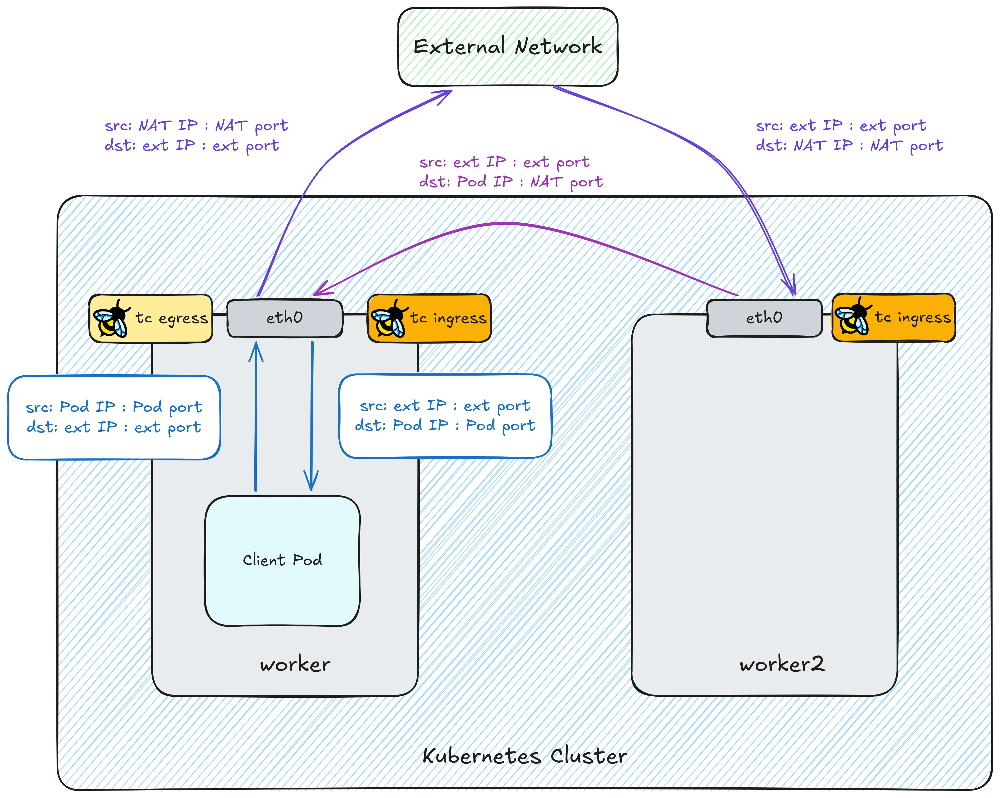
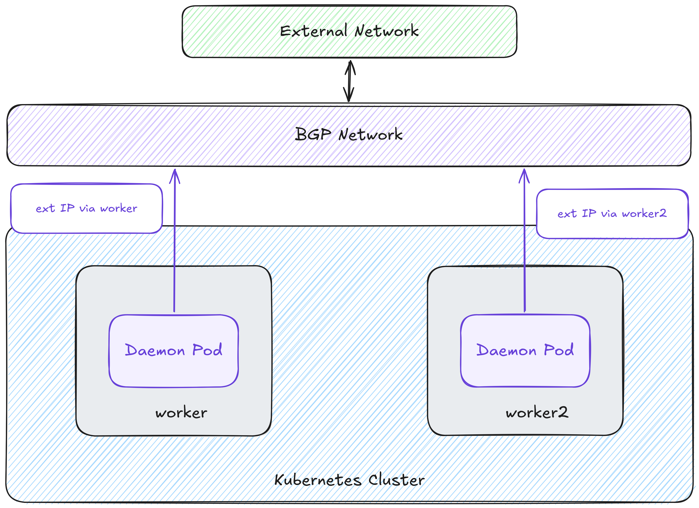

# mooring

Kubernetes-native egress NAT with connection resiliency. No dedicated NAT pods, no encapsulation, no dropped connections on rollout.

## Motivation

Existing egress NAT solutions (e.g. [cybozu-go/coil](https://github.com/cybozu-go/coil)) bind global IPs to dedicated NAT pods and advertise them via BGP. Any rollout of those pods drops every active connection passing through them, because TCP state cannot be handed over.

mooring eliminates this by moving SNAT to the client pod's own node and decoupling external IP identity from any individual pod or node.

## Key Properties

- **No encapsulation**: no MTU overhead, no tunnel management.
- **No dedicated NAT pods**: the client pod's node performs SNAT directly.
- **Shared external IPs**: all nodes advertise every external IP via BGP (ECMP), so any node can handle return traffic.
- **Rollout-resilient**: BPF programs and maps are pinned to bpffs; in-flight connections survive daemon restarts.
- **No NAT table collisions**: port ranges are allocated per `(pod, external IP)` pair, making them non-overlapping by construction.
- **CNI-agnostic by default**: works with any veth-based CNI; Cilium is an optional integration.

## How It Works

### Data Plane



**Outbound (SNAT):** A TC egress BPF program on the node uplink rewrites the source address from `pod-IP:pod-port` to `externalIP:NAT-port` and records the mapping in a per-node NAT table.

**Return path (two-stage revNAT):** Return traffic is distributed across all nodes via BGP ECMP. A TC ingress BPF program on the node uplink handles both stages:

1. **Stage 1 (IP revNAT):** Uses the `(external IP, NAT port)` pair to look up pod IP from the shared port-range lookup map and rewrites the destination IP.
2. **Stage 2 (port revNAT):** Looks up the full NAT entry and restores the original pod port.

If the pod is on the same node, both stages complete in a single BPF pass. If the pod is on a different node, BGP routes the packet there and the uplink ingress program on that node handles stage 2.

Stage 2 does not need the external IP: a pod's port ranges are allocated with non-overlapping indices across all of its external IPs, so once stage 1 has rewritten the destination to pod-IP, the NAT port unambiguously identifies the original connection in the NAT table.

### Control Plane

#### Port Allocation

The operator assigns a non-overlapping port range to every `(pod, external IP)` pair. With `portRangeSize: 100`, the allocations for two pods might look like:

| | 203.0.113.1 | 203.0.113.2 |
|---|---|---|
| pod-foo | 1300–1399 (block 3) | 1700–1799 (block 7) |
| pod-bar | 1700–1799 (block 7) | 1300–1399 (block 3) |

Two invariants hold simultaneously:
- **Within a pod's row**, block indices are always different: pod-foo holds blocks 3 and 7, never the same index twice. This ensures the pod's own port ranges don't overlap across external IPs, making stage 2 unambiguous.
- **Within an external IP's column**, each port range belongs to at most one pod, so no two pods share the same ports on a given IP and stage 1 lookup is unambiguous.

The operator is responsible for this allocation and records the result in a `NATPortRange` custom resource, one per `(pod, NATConfig)` pair. Every daemon pod watches these resources and syncs their allocations into the BPF lookup maps. See [DESIGN.md](DESIGN.md) for the full allocation strategy.

**Operator** manages the port allocation lifecycle:
- Allocates port ranges when a new pod matches a `NATConfig` and frees them after the pod terminates (with a 240 s grace period to let `TIME_WAIT` connections drain).
- Updates allocations in-place when `externalIPPool` changes, with no churn to existing entries.

**Daemon (DaemonSet)** manages the data plane per node:
- Attaches TC BPF programs to the node uplink once at startup; skips re-attachment if programs are already pinned from a prior run.
- Watches `NATPortRange` resources cluster-wide and syncs their allocations into BPF maps on every node.

#### BGP Underlay



Every node advertises all external IPs in the pool via BGP (ECMP). This ensures return traffic from an external server can reach any node, regardless of which node performed the original SNAT. The node that ran Stage 1 revNAT forwards cross-node packets to the pod's home node via existing BGP pod-CIDR routes.

## Getting Started

### Prerequisites

- BGP underlay with pod CIDRs advertised natively (overlay networks are not supported).
- Veth-based pod networking: any CNI that creates a veth pair per pod.

### Install

```sh
kubectl apply -f manifests/crds/
kubectl apply -f manifests/operator.yaml
kubectl apply -f manifests/daemonset.yaml
```

### Configure NATConfig

Create a `NATConfig` that defines the external IP pool and the pod selector:

```yaml
apiVersion: hanapedia.link/v1alpha1
kind: NATConfig
metadata:
  name: prod
spec:
  # CIDR blocks that provide the external (SNAT) source IPs.
  # All IPs in these ranges are advertised via BGP from every node.
  externalIPPool:
    - "203.0.113.0/28"
  # Number of ports per allocation block per (pod, external IP) pair.
  # Bounds max concurrent connections: portRangeSize × portRangeCount per pod per IP.
  portRangeSize: 100
  # Destination CIDRs for which SNAT is applied.
  targetCIDRs:
    - "0.0.0.0/0"
  # Label selector: pods matching this are automatically enrolled in this NATConfig.
  podSelector:
    matchLabels:
      egress: prod
```

Any pod with the matching label is automatically enrolled:

```yaml
apiVersion: v1
kind: Pod
metadata:
  name: my-app
  labels:
    egress: prod  # matches the NATConfig above
spec:
  containers:
    - name: app
      image: my-app:latest
```

## Limitations

- **Max concurrent connections**: for a given external IP, the number of concurrent connections a pod can open to the same destination `(IP, port)` is bounded by its assigned port range (`portRangeSize × portRangeCount`). Pods expecting a high number of concurrent connections should request a higher `portRangeCount`.
- **BGP underlay with native pod routing is required.** Overlay networks are not supported. Other routing methods may be supported in the future.
- **BPF attachment ordering**: mooring attaches TC programs to the node uplink. Other solutions that also attach eBPF programs to the same interface (e.g. Cilium) may have ordering dependencies that need to be accounted for.
